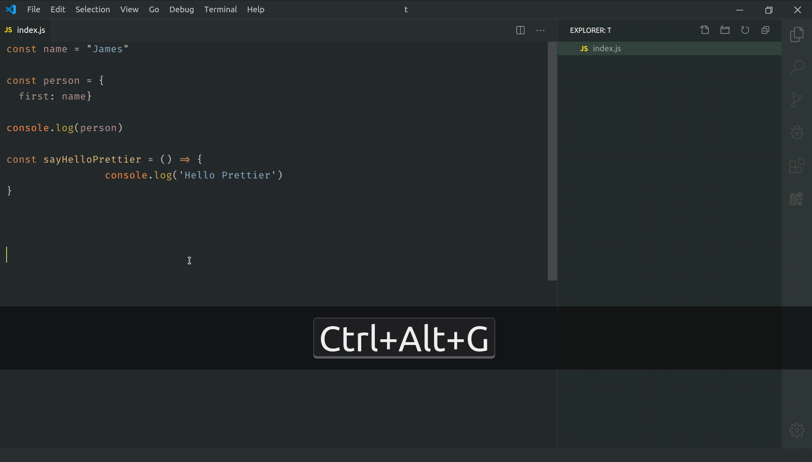

[](https://travis-ci.com/SimonSiefke/prettier-vscode) [](https://marketplace.visualstudio.com/items?itemName=SimonSiefke.prettier-vscode) [](https://renovatebot.com/)

# Prettier for VSCode



## Recommended Settings

For best editing experience, the following settings are recommended:

```json
{
  "editor.formatOnSave": true,
  "editor.defaultFormatter": "SimonSiefke.prettier-vscode"
}
```

<br>
<br>

## Differences to the official prettier extension

|                                                                                                                                  | This extension | [Official Prettier Extension](https://github.com/prettier/prettier-vscode) |
| -------------------------------------------------------------------------------------------------------------------------------- | -------------- | -------------------------------------------------------------------------- |
| Out of the box support for JavaScript, TypeScript, Flow, JSX, JSON, CSS, SCSS, Less, HTML, Vue, Angular, GraphQL, Markdown, YAML | ✅             | ✅                                                                         |
| Out of the box support for C#, Elm, Java, Svelte, Twig, XML                                                                      | ✅             |                                                                            |
| Works without `npm install`                                                                                                      | ✅             |                                                                            |
| Activates lazily                                                                                                                 | ✅             |                                                                            |
| Implemented as a language server so that it never slows down VSCode                                                              | ✅             |                                                                            |
| More configuration options                                                                                                       |                | ✅                                                                         |
| Less configuration options, more opinionated                                                                                     | ✅             |                                                                            |
| Plugin support                                                                                                                   | not yet        | ✅                                                                         |

<br>

<!--
## Settings

| Property                    | Default                                                                                                                                                                                                                                                          |
| --------------------------- | ---------------------------------------------------------------------------------------------------------------------------------------------------------------------------------------------------------------------------------------------------------------- |
| prettier.enabledLanguageIds | `["csharp", "css", "elm", "flow", "graphql", "html", "java","javascript", "javascriptreact", "json", "jsonc", "less", "markdown", "mdx", "php", "postcss", "ruby", "scss", "solidity", "svelte", "typescript", "typescriptreact", "twig", "vue", "xml", "yaml"]` |

-->
<!--
## Supported Languages

- Angular
- C#
- CSS
- Elm
- Flow
- GraphQL
- HTML
- Java
- JavaScript / JSX
- JSON / JSONC
- LESS
- Markdown
- MDX
- Php
- PostCSS
- Ruby
- SCSS
- Solidity
- Svelte
- TypeScript / TSX
- Twig
- Vue
- XML
- YAML -->
